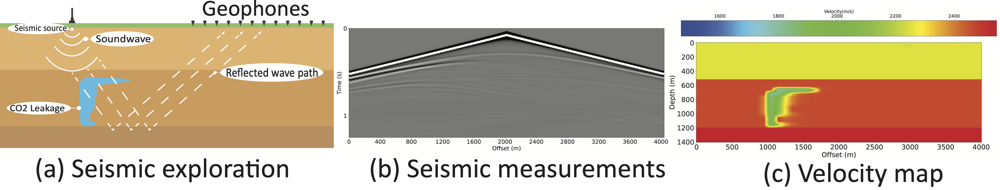

## EdGeo

Implementation of EdGeo, a velocity map conditioned diffusion-based generative model, used for geoscience.

The original dataset "Kimberlina-CO2" can be found at 
https://smileunc.github.io/projects/openfwi/datasets.

An example of the application:




## Usage for conditioned velocity map generation

Please follow the https://pytorch.org/ to install torch at first.

Then install the packages:

```bash
pip install -r requirements.txt
```

Prepare the dataset, with paired "condition" velocity map and "training" velocity map. The  CO<sub>2</sub> leakage at previous timestep will use as condition, for example, "label_sim0001_t20.npz" will be the condition of "label_sim0001_t30.npz". 

The used data can be put in the example.csv file, and will be processed with the correct dataset directory automatically.

Change the configurations in the train.py, and run train.py to train the diffusion based model.

```bash
python train.py
```

After the model is trained, change the configuration in the generation.py. And prepare the conditions in the "gen_cond" directory, and rename the files similar to "label_sim[xxxx]_t20.npz", where [xxxx] is four digits as the original dataset.

Run generation.py to generate velocity maps.

```bash
python generation.py
```
An example output (training without leakage occuring at shallow):


## Usage for leakage movement and distribution alignment 

Prepare the data as known distribution as the "dist_path" in the move_and_align.py, and run it, the modified velocity maps will be saved at './saved_move_align', and the visualizations will be saved at './vis_dir'.

```bash
python move_align.py
```

An example output after move and align leakage:


## Comments

Our codebase for the diffusion models builds heavily following code. Thanks for open-sourcing!

- https://github.com/lucidrains/denoising-diffusion-pytorch

- https://github.com/CompVis/stable-diffusion

Resources of datasets and InversionNet (reconstruct velocity map from seismic wave) can be found at https://smileunc.github.io/projects/openfwi/resources and https://github.com/lanl/OpenFWI.

## BibTeX
```
@article{yang2024physics,
  title={A Physics-guided Generative AI Toolkit for Geophysical Monitoring},
  author={Yang, Junhuan and Wang, Hanchen and Sheng, Yi and Lin, Youzuo and Yang, Lei},
  journal={arXiv preprint arXiv:2401.03131},
  year={2024}
}
```